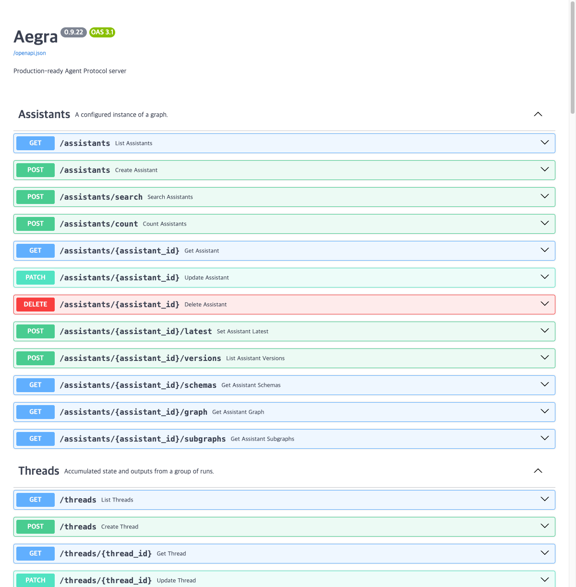
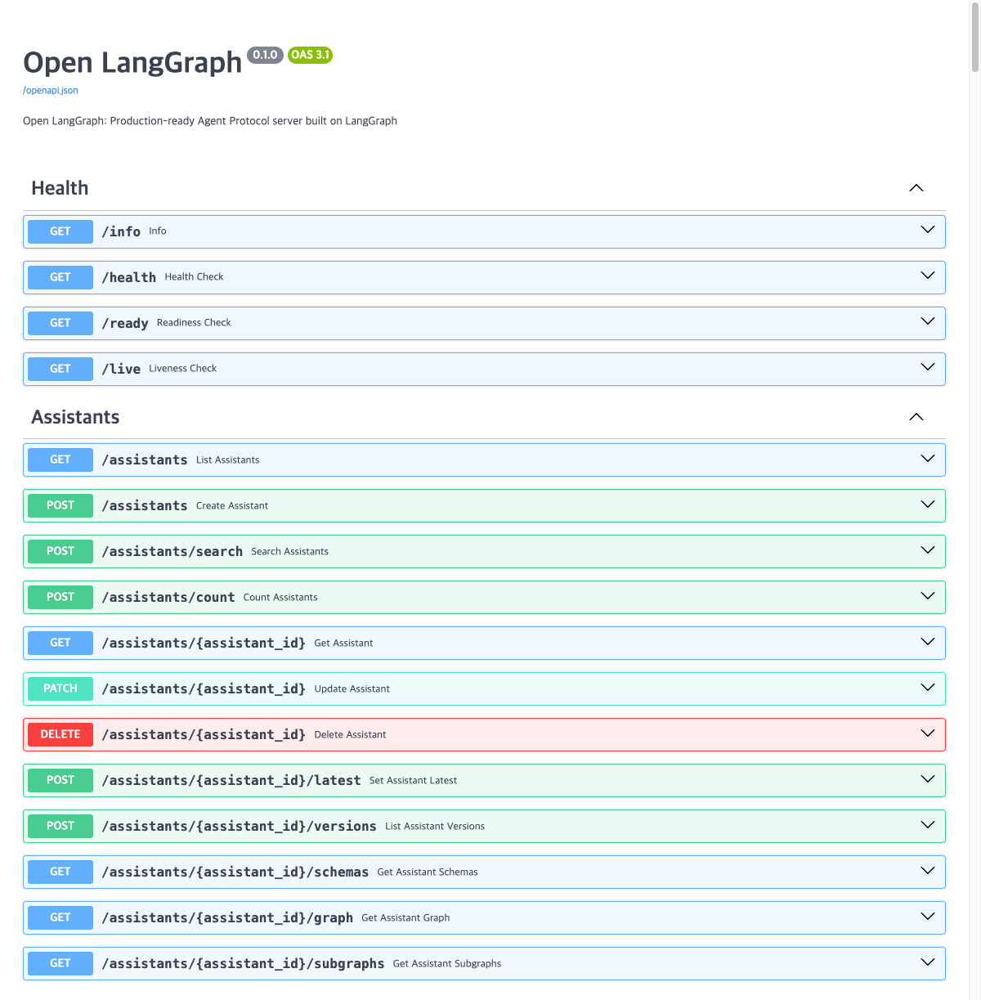
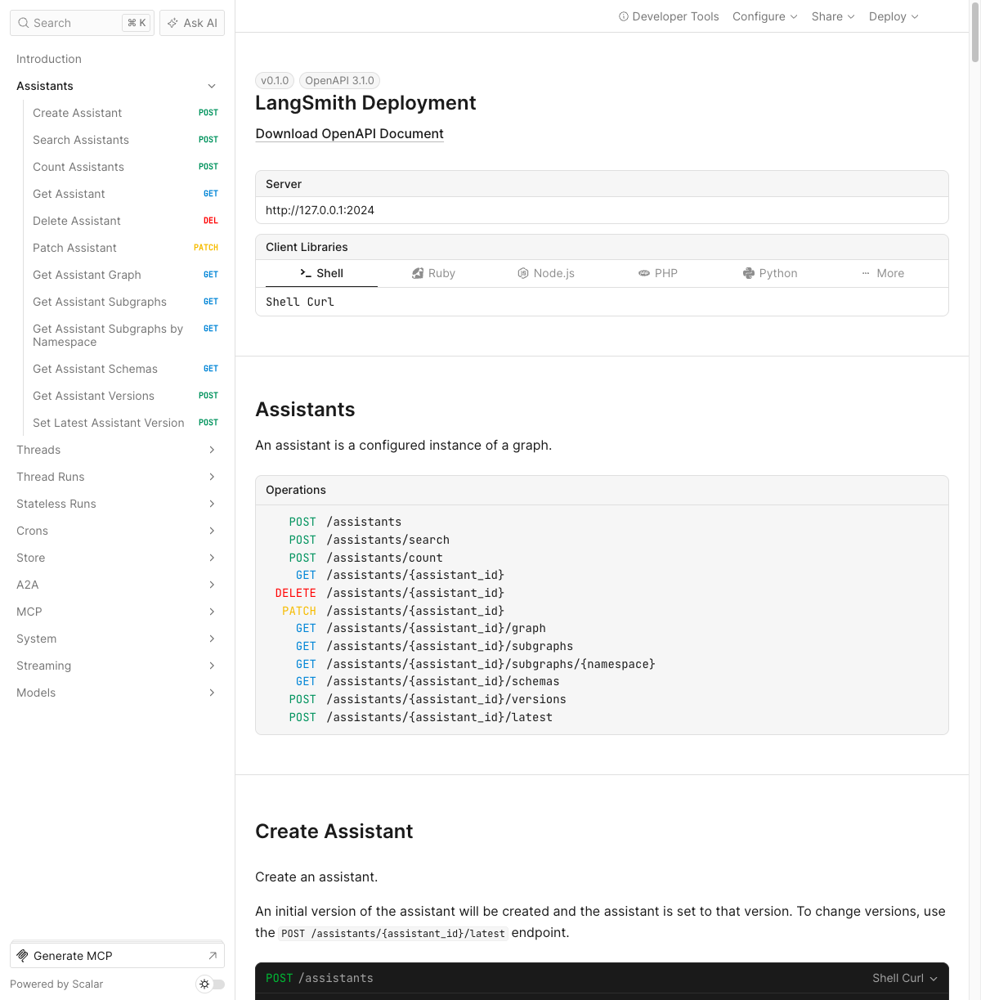
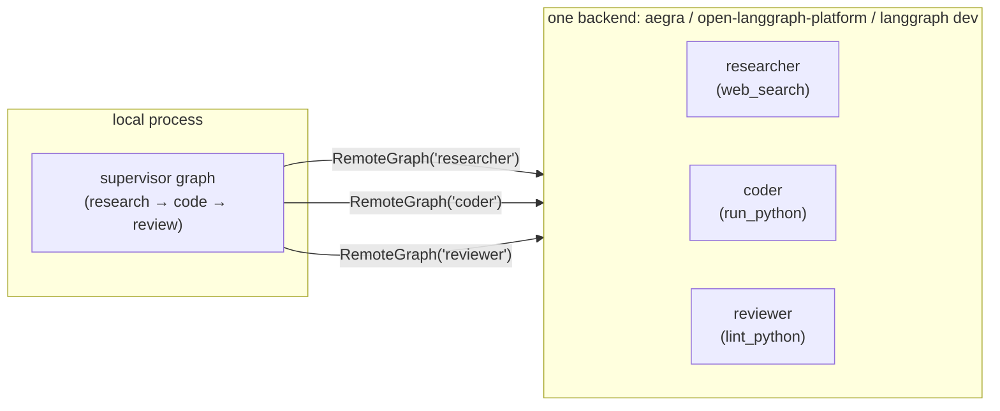
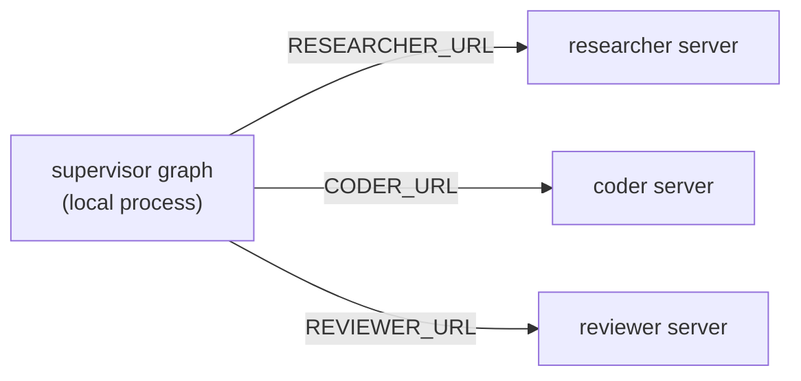
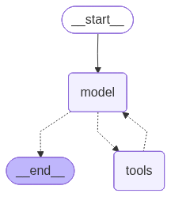
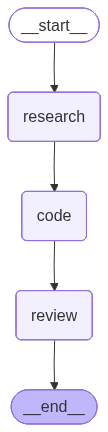
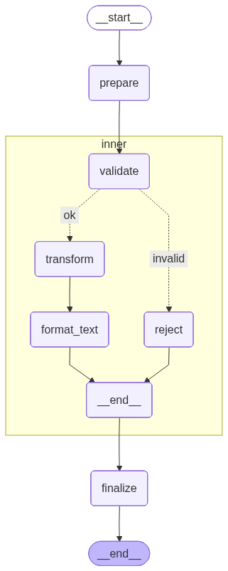
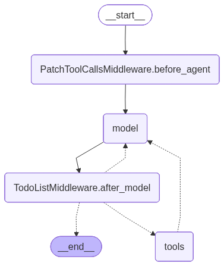

# Experiment Report: RemoteGraph across three self-hosted backends

This report captures the results of actually running all three backends end-to-end via `remotegraph`, with real LLM calls against a local [LM Studio](https://lmstudio.ai/) server (`google/gemma-4-e4b`) under [OrbStack](https://orbstack.dev/). Full, reproducible, re-executable experiments live in [`notebooks/`](notebooks/) — this document is the human-readable summary of one execution of each.

## Summary

| Backend | Notebook | Status | Swagger / API docs |
|---|---|---|---|
| `aegra` | [`aegra.ipynb`](notebooks/aegra.ipynb) | ✅ deploy → list → call ×3 → supervisor pipeline → teardown, all clean |  |
| `open-langgraph-platform` | [`open_langgraph_platform.ipynb`](notebooks/open_langgraph_platform.ipynb) | ✅ same, after the upstream fixes in [Known upstream issues](README.md#known-upstream-issues) |  |
| `langgraph-platform` (`langgraph dev`) | [`langgraph_platform.ipynb`](notebooks/langgraph_platform.ipynb) | ✅ same, no Docker |  |
| Subgraph control | [`subgraph_verification.ipynb`](notebooks/subgraph_verification.ipynb) | ✅ `stream_subgraphs` + `interrupt_before` confirmed working against a real branching subgraph, via `langgraph-platform` | — |
| Autonomous supervisor (`deepagents`) | [`autonomous_supervisor.ipynb`](notebooks/autonomous_supervisor.ipynb) | ✅ `task`-tool delegation to real `RemoteGraph`-backed agents confirmed, via `langgraph-platform` | — |

Every backend was exercised through the identical sequence: `backend.deploy(...)` → `backend.up()` → list assistants → call `coder`/`researcher`/`reviewer` directly → run the `supervisor` graph locally (which calls all three over `RemoteGraph`) → `backend.down()`.

## Architecture

This pilot's setup — all three agents on one shared backend, as actually tested above:



The target distributed shape — each agent on its own server, supported since the `RESEARCHER_URL`/`CODER_URL`/`REVIEWER_URL` change (see [README.md](README.md#distributed-deployment-each-agent-on-its-own-server)):



`researcher`/`coder`/`reviewer` are all the same shape — a standard `create_agent` ReAct loop (model ⇄ tools) — and `supervisor` is a plain linear pipeline. Both diagrams below are generated directly from the compiled graph objects (`graph.get_graph(xray=True).draw_mermaid_png()`), not hand-drawn:

| `researcher` / `coder` / `reviewer` (same shape) | `supervisor` |
|---|---|
|  |  |

`agents/subgraph_demo/graph.py`'s structure, with the `inner` subgraph expanded (`xray=True`) — see [Subgraph control](#subgraph-control) below:



`agents/autonomous_supervisor/graph.py`'s structure -- `create_deep_agent`'s own middleware stack (todo list, tool-call patching) wrapping the model ⇄ tools loop; `researcher`/`coder`/`reviewer` are registered as `CompiledSubAgent`s dispatched through `tools`, not drawn as separate nodes here — see [Autonomous supervisor (deepagents)](#autonomous-supervisor-deepagents) below:



## aegra

```
$ remotegraph host up aegra
aegra is up at http://127.0.0.1:2026

$ remotegraph agent list --backend aegra
ad9aa870-1e45-562b-a83d-73b96694ea13  graph_id=coder
c926ac5a-b04e-5949-878a-8e4830d4338b  graph_id=researcher
ca7018db-539a-5a5f-b9c2-8622330bec7d  graph_id=reviewer

$ remotegraph agent call coder "What is 13 * 7? Just the number." --backend aegra
91

$ remotegraph agent call researcher "What is LangGraph in one sentence?" --backend aegra
LangGraph is a library built by the LangChain team that allows developers to create
complex, stateful AI applications—including single or multi-agent systems—by modeling
the interaction flow as a deterministic graph.

$ remotegraph agent call reviewer "Review this code: def add(a, b): return a + b" --backend aegra
The code is correct and achieves its intended purpose of adding two numbers.
Verdict: Passes linting.
```

Supervisor pipeline (research → code → review), driven entirely over `RemoteGraph`:

```
--- research ---
square = lambda x: x * x          # (alternatively: pow(x, 2))

--- code ---
square = lambda x: x * x

--- review ---
The code is correct and follows good Python style for a simple anonymous
function assignment. Verdict: Correct and idiomatic.
```

## open-langgraph-platform

Same sequence, against the Docker image built from the vendored fork (`vendor/open-langgraph-platform`, branch `fix/immutable-index-now-predicate`):

```
$ remotegraph host up open-langgraph
open-langgraph is up at http://127.0.0.1:8001

$ remotegraph agent call coder "What is 13 * 7? Just the number." --backend open-langgraph
91

$ remotegraph agent call researcher "What is LangGraph in one sentence?" --backend open-langgraph
LangGraph is an open-source framework within the LangChain ecosystem that allows
developers to build, manage, and execute complex AI agent workflows as controllable,
stateful graphs.

$ remotegraph agent call reviewer "Review this code: def add(a, b): return a + b" --backend open-langgraph
The code is correct and follows Python style conventions. Verdict: Passes review.
```

Supervisor pipeline:

```
--- research ---
def square(n): return n * n      # (alternatively: n ** 2)

--- code ---
square = lambda n: n * n

--- review ---
Verdict: Correct. Syntactically correct, executes as expected, and uses a
concise, idiomatic Python lambda function to map the squaring operation.
```

`remotegraph agent list --backend open-langgraph` returns an empty list (a real upstream multi-tenancy filtering bug — see [README.md](README.md#known-upstream-issues)); `agent call`/`RemoteGraph` are unaffected since they address a graph ID directly, as shown above.

## langgraph-platform (`langgraph dev`)

No Docker — `backend.up()` spawns `langgraph dev` as a local subprocess:

```
$ remotegraph agent deploy langgraph-platform
Deployed ['researcher', 'coder', 'reviewer'] to langgraph-platform (http://127.0.0.1:2024)

$ remotegraph agent list --backend langgraph-platform
ca7018db-539a-5a5f-b9c2-8622330bec7d  graph_id=reviewer
c926ac5a-b04e-5949-878a-8e4830d4338b  graph_id=researcher
ad9aa870-1e45-562b-a83d-73b96694ea13  graph_id=coder

$ remotegraph agent call coder "What is 16 + 26? Just the number." --backend langgraph-platform
42
```

Supervisor pipeline:

```
--- research ---
square = lambda x: x**2

--- code ---
square = lambda x: x**2

--- review ---
Verdict: Mostly Correct, but Stylistically Flawed
The code is functionally correct... using a simple assignment for a multi-line
or complex function body is usually better served by `def`.
```

Notably, this run's `reviewer` gave a stricter, more stylistically opinionated verdict than the other two backends for the same lambda-based code — a reminder that these are real (small, local) LLM calls, not fixtures, and minor wording/judgment varies run to run.

## Subgraph control

`researcher`/`coder`/`reviewer` are flat ReAct agents and can't prove `RemoteGraph` controls *inside* a remote graph rather than calling it as an opaque unit. [`agents/subgraph_demo/`](agents/subgraph_demo/) is a small, deterministic, LLM-free graph with branching -- `prepare -> inner (subgraph: validate -> {transform -> format_text | reject}) -> finalize` -- built specifically to check this, and defined declaratively (see [Workflow / subgraph-workflow patterns](#workflow--subgraph-workflow-patterns-yaml) below). See [`notebooks/subgraph_verification.ipynb`](notebooks/subgraph_verification.ipynb) for the full run against `langgraph-platform`.


```
=== stream_subgraphs=True, input="hello" (non-empty) ===
updates -> {'prepare': {'text': '[prepared] hello'}}
updates|inner:fddc06a1-... -> {'validate': {'text': '[prepared] hello'}}
updates|inner:fddc06a1-... -> {'transform': {'text': 'HELLO [PREPARED]'}}
updates|inner:fddc06a1-... -> {'format_text': {'text': '[HELLO [PREPARED]]'}}
updates -> {'inner': {'text': '[HELLO [PREPARED]]'}}
updates -> {'finalize': {'text': '[HELLO [PREPARED]] [finalized]'}}

=== stream_subgraphs=True, input="   " (empty) ===
updates -> {'prepare': {'text': '[prepared]    '}}
updates|inner:11261985-... -> {'validate': {'text': '[prepared]    '}}
updates|inner:11261985-... -> {'reject': {'text': '[rejected: empty input]'}}
updates -> {'inner': {'text': '[rejected: empty input]'}}
updates -> {'finalize': {'text': '[rejected: empty input] [finalized]'}}

=== interrupt_before=["inner"] ===
updates -> {'prepare': {'text': '[prepared] world'}}
updates -> {'__interrupt__': []}
next: ['inner']
values: {'text': '[prepared] world'}      # subgraph hasn't run yet

=== resume ===
updates -> {'inner': {'text': '[WORLD [PREPARED]]'}}
updates -> {'finalize': {'text': '[WORLD [PREPARED]] [finalized]'}}
next: []
```

Confirmed: subgraph-internal events are visible with a distinct namespace (`updates|inner:<ns-id>`) -- including *which branch* was taken -- `interrupt_before` genuinely pauses before the subgraph executes (not just before some equivalent top-level checkpoint), and resuming continues through it correctly — through the actual `RemoteGraph` class, not just the raw SDK client.

## Workflow / subgraph-workflow patterns (YAML)

[`src/remotegraph/workflow.py`](src/remotegraph/workflow.py) compiles a `StateGraph` from a YAML/JSON spec: `fn:` nodes are dotted import-path functions, `workflow:` nodes recursively load another spec and add it as a **subgraph** node, edges support plain pairs and `conditional:` routing. Two examples prove both pattern types:

- **Subgraph workflow pattern**: `agents/subgraph_demo/workflow.yaml` + `inner_workflow.yaml` *are* `agents/subgraph_demo/graph.py` (`graph = load_workflow(...)`, one line) — the branching graph diagrammed above.
- **Plain workflow pattern**: `agents/workflows/research_pipeline.yaml` re-declares `agents/supervisor/graph.py`'s `research -> code -> review` topology by referencing that file's existing node functions. `tests/test_workflow.py::test_research_pipeline_yaml_matches_supervisor_graph` asserts the two graphs have identical node/edge sets — the pattern is proven without touching the already-tested hand-written supervisor.

## Autonomous supervisor (deepagents)

Evaluated whether a `deepagents`-based autonomous supervisor gets the same subgraph-level control verified above. It does not: `create_deep_agent`'s sub-agent delegation goes through a `task` *tool* (an LLM decision at runtime), which looks like an ordinary tool-call to `RemoteGraph`, not a namespaced subgraph stream event. `stream_subgraphs`/`interrupt_before` don't apply to it.

What does work, with no wrapper code: `deepagents.middleware.subagents.CompiledSubAgent.runnable` accepts any `Runnable`, and `RemoteGraph` is one. [`agents/autonomous_supervisor/graph.py`](agents/autonomous_supervisor/graph.py) registers `researcher`/`coder`/`reviewer` directly. One real run, given "Write a one-line python function that returns the cube of a number, then have it reviewed.":

```
human -> Write a one-line python function that returns the cube of a number, then have it reviewed.
ai -> [task(subagent_type='coder', description='Write a one-line Python function named `cube` that takes a number `n` and returns its cube ($n^3$)...')]
tool -> None
ai -> [task(subagent_type='reviewer', description='Review the following one-line Python function for correctness and adherence to style guidelines:\ndef cube(n): return n ** 3')]
tool -> None
ai -> ```python
      def cube(n):
          return n ** 3
      ```
```

The supervisor autonomously called `coder` then `reviewer`, with zero fixed pipeline code — each `task` call actually dispatched to the real remote `langgraph-platform`-hosted agent. See [`notebooks/autonomous_supervisor.ipynb`](notebooks/autonomous_supervisor.ipynb) for the full run with the rendered graph diagram.

A real bug surfaced while getting this to run reliably: `LangGraphPlatformBackend.up()` spawned `langgraph dev` via `uv run`, which doesn't exec-replace itself -- it keeps running as a parent of the actual server process. `down()` only killed that parent PID, orphaning the server child holding port 2024 forever. Across repeated up/down cycles during testing, multiple orphaned servers piled up, each contending for the same single in-memory worker -- which is what the early timeouts in this section actually were, not the model being slow. Fixed by starting the subprocess with `start_new_session=True` and killing the whole process group (`os.killpg`) in `down()`.

## Reproducing this

```bash
uv sync
cp .env.sample .env   # configure your OpenAI-compatible endpoint
uv run jupyter nbconvert --to notebook --execute --inplace notebooks/aegra.ipynb
uv run jupyter nbconvert --to notebook --execute --inplace notebooks/open_langgraph_platform.ipynb
uv run jupyter nbconvert --to notebook --execute --inplace notebooks/langgraph_platform.ipynb
uv run jupyter nbconvert --to notebook --execute --inplace notebooks/subgraph_verification.ipynb
uv run jupyter nbconvert --to notebook --execute --inplace notebooks/autonomous_supervisor.ipynb
```

Each notebook is self-contained: it starts its backend, deploys the agents, runs the calls and the supervisor pipeline, and tears the backend back down at the end.
