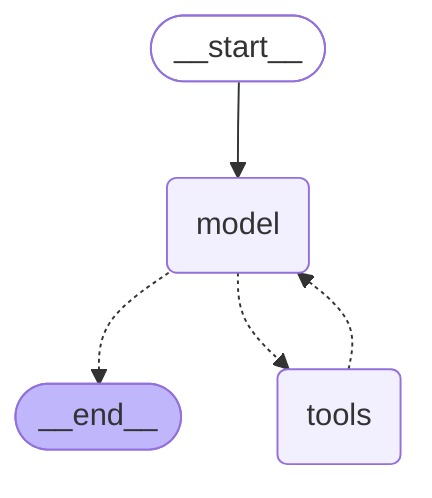
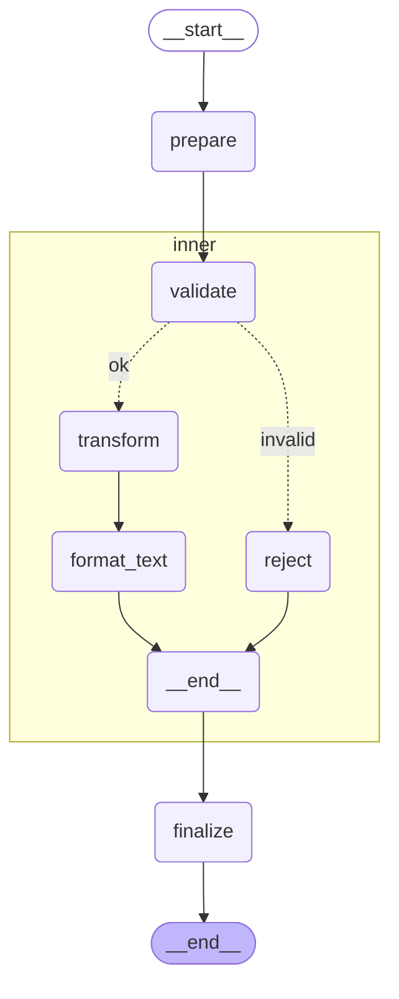
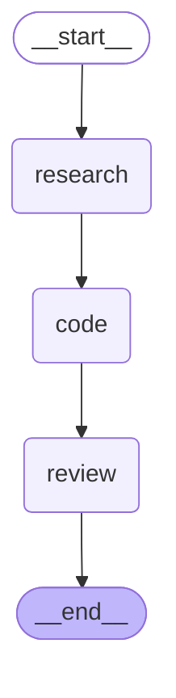

<div align="center">

# Prompt Scenario Demonstration: English

[한국어 버전](experiments-ko.md) · [Main README](../README.md)

</div>

This document is a **hands-on demonstration**, in English, that `RemoteGraph` actually behaves as expected across a range of prompts and scenarios. Every quoted reply below is a real response captured by calling the live agents (`coder`, `researcher`, `reviewer`, `subgraph_demo`) deployed to a running backend (`langgraph-platform`, via `langgraph dev`) through the `RemoteGraph`/`langgraph_sdk` client. The reproduction script is [`scripts/run_experiments.py`](../scripts/run_experiments.py); the raw capture is [`docs/experiments/raw/en.json`](experiments/raw/en.json).

The LLM backing these agents is a local LM Studio instance (`google/gemma-4-e4b`) — proof that the whole pipeline works without a cloud API key.

## 1. Simple Q&A (single call)

The baseline scenario: send one message to a remote graph, get a reply back. The target is `coder` — a ReAct-pattern graph; `researcher`/`reviewer` share the exact same shape.


- Input: `What is 12 times 8? Answer with just the number.`
- Reply: `96`

→ `RemoteGraph.invoke()` round-trips a plain message and the remote `coder` agent answers correctly. This particular call never touched `tools` — it went straight `__start__ → model → __end__`.

## 2. Multi-turn thread persistence

Two calls on the same `thread_id`, to confirm the remote server actually retains conversational context. The topology is the same `coder` graph as scenario 1; both `invoke()` calls restart from `__start__` on the same `thread_id` — the persisted state lives in the server's thread store, not inside the graph.


- Turn 1 input: `My favorite number is 7. Remember it.`
- Turn 1 reply: `I have remembered that your favorite number is 7.`
- Turn 2 input: `What is my favorite number plus 10?`
- Turn 2 reply: `Your favorite number plus 10 is 17.`

→ Passing only `config={"configurable": {"thread_id": ...}}` is enough — the client holds no state itself, yet the server-side thread keeps the conversation going.

## 3. Streaming

Using `client.runs.stream(..., stream_mode="values")` to confirm intermediate events actually arrive in sequence. Same `coder` graph again; `stream_mode="values"` emits one event per state snapshot as execution passes from `__start__` through to `__end__`.



- Input: `Count from 1 to 5.`
- Events received: 3 (`metadata` → `values` echo → `values` final answer)
- Final answer: `1\n2\n3\n4\n5`

→ Streaming mode delivers the echo step and the final answer as two distinct events, in order.

## 4. Subgraph branch control

`subgraph_demo` (`prepare → inner(subgraph: validate → {transform → format_text | reject}) → finalize`) is given different inputs to force each branch. The `inner` node is itself a compiled subgraph, so expanding it with `xray=True` reveals the `validate`/`transform`/`format_text`/`reject` nodes and the conditional edge directly.



The two inputs below actually take `validate`'s `ok`/`invalid` branches respectively — `__start__ → prepare → inner:validate → (ok: inner:transform → inner:format_text / invalid: inner:reject) → inner:__end__ → finalize → __end__`.

| Input | Branch taken | Final result |
|---|---|---|
| `hello remotegraph` | `transform → format_text` | `[REMOTEGRAPH HELLO [PREPARED]] [finalized]` |
| `""` (empty string) | `reject` | `[rejected: empty input] [finalized]` |

→ This graph is deterministic and LLM-free, so it conclusively proves that `RemoteGraph` actually drives the conditional branching *inside* the remote graph, not just the graph as an opaque black box.

## 5. Error / edge case — calling a nonexistent assistant

Calling a graph name that was never deployed (`does-not-exist`), to see how the client surfaces the failure. Not even `__start__` runs here — the server rejects the assistant name against its registered-graph list and returns a 422 before any graph execution begins, which is itself the point: there is no topology to show.

```
UnprocessableEntityError: Invalid assistant: 'does-not-exist'. Must be either:
- A valid assistant UUID, or
- One of the registered graphs: researcher, coder, reviewer, subgraph_demo
```

→ The server returns a 422, and `langgraph_sdk` raises a specific exception type (`UnprocessableEntityError`) carrying the list of valid graphs. No silent failure.

## 6. Multi-agent pipeline (research → code → review)

`agents/supervisor/graph.py` calls three **remote** graphs (`researcher`/`coder`/`reviewer`) in sequence, each through its own `RemoteGraph` instance.



That's the supervisor's own **local** graph topology. Each of `research`/`code`/`review` internally calls `RemoteGraph("researcher"/"coder"/"reviewer", url=...).invoke(...)`, and each of those remote calls runs the exact same `__start__ → model ⇄ tools → __end__` graph from scenario 1, start to finish. So in practice four graphs — the supervisor plus three remote ReAct graphs — each run independently from their own `__start__`.

- Task: `Write a one-line python function that returns the square of a number.`
- `coder` output: `def square(n): return n**2`
- `reviewer` verdict (summary): "Correct and adheres to good Pythonic style for its simplicity. Excellent."

→ The supervisor never imports any of the three agents' graph code — it only ever talks to them over the network via `RemoteGraph` — and a coherent, meaningful review still comes out the other end.

## Summary

| Scenario | What it confirms |
|---|---|
| Simple call | Basic invoke round-trips correctly |
| Multi-turn | Server-side thread state persists without client-side bookkeeping |
| Streaming | Intermediate events arrive in order, with correct content |
| Subgraph branching | Conditional branches inside a remote graph are actually exercised, not just invoked as a black box |
| Error case | Invalid calls fail loudly with a typed exception, not silently |
| Multi-agent pipeline | Composing independent remote graphs still produces a meaningful end-to-end result |

The same 7 scenarios reproduced in Korean are documented in the [한국어 버전](experiments-ko.md).
